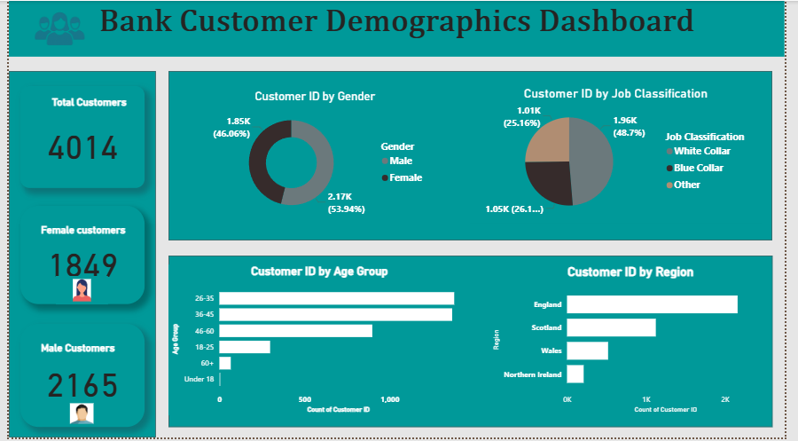
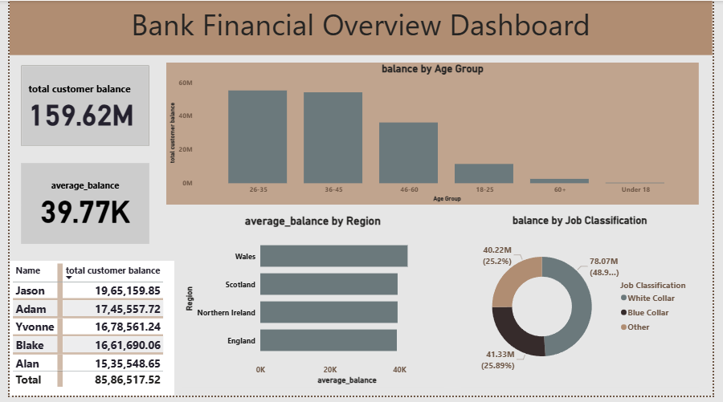

# Bank Customer Demographics Dashboard

## 📊 Project Overview
This Power BI project focuses on analyzing bank customer demographics to gain insights into customer distribution, behavior, and trends. The dashboard helps in understanding key customer segments based on factors such as age, gender, geography, and account-related attributes.

## 🎯 Objective
The main objective of this project is to:
- Analyze customer demographics
- Identify patterns and trends in customer data
- Support better decision-making for customer targeting and marketing strategies

## 🛠️ Tools & Technologies Used
- Power BI
- Microsoft Excel / CSV (Dataset)

## 📈 Key Insights
- Distribution of customers across different age groups
- Gender-wise customer analysis
- Geographic distribution of customers
- Relationship between customer attributes and account activity

## 📊 Dashboard Features
- Interactive visualizations
- Filters and slicers for dynamic analysis
- Clear representation of demographic patterns

## 📁 Dataset
The dataset contains customer-related information such as:
- Customer ID
- Age
- Gender
- Location
- Account details (balance, activity, etc.)

## 📸 Screenshots
## 📸 Dashboard Screenshot

## 🚀 Conclusion
This dashboard provides valuable insights into customer demographics, helping banks better understand their customers and improve decision-making processes.
